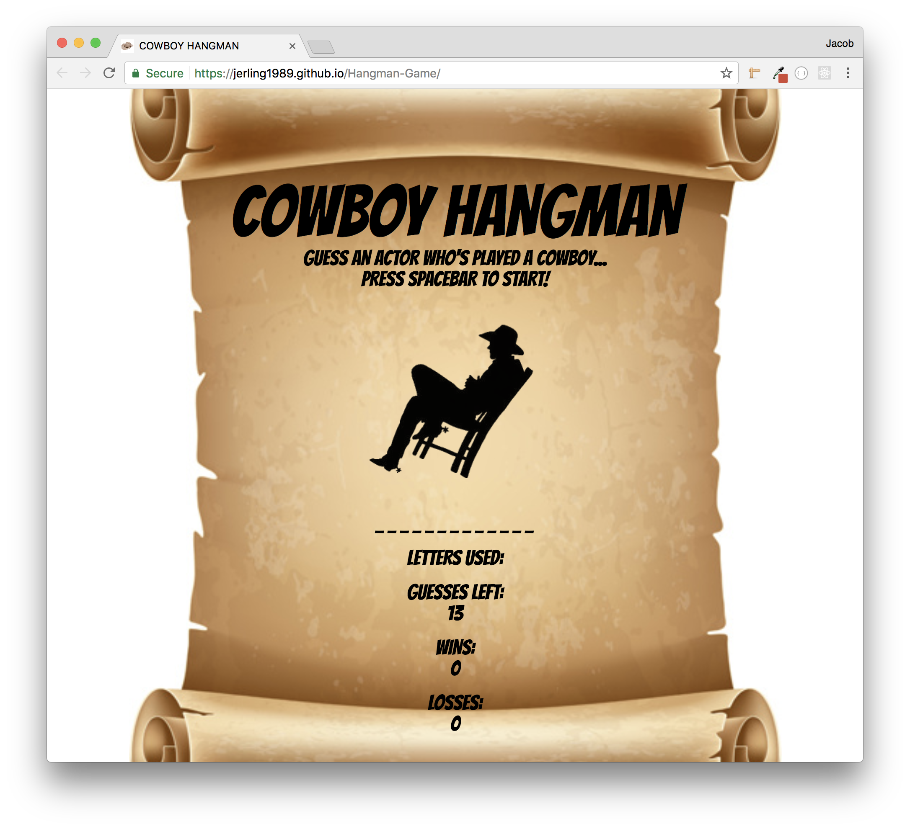
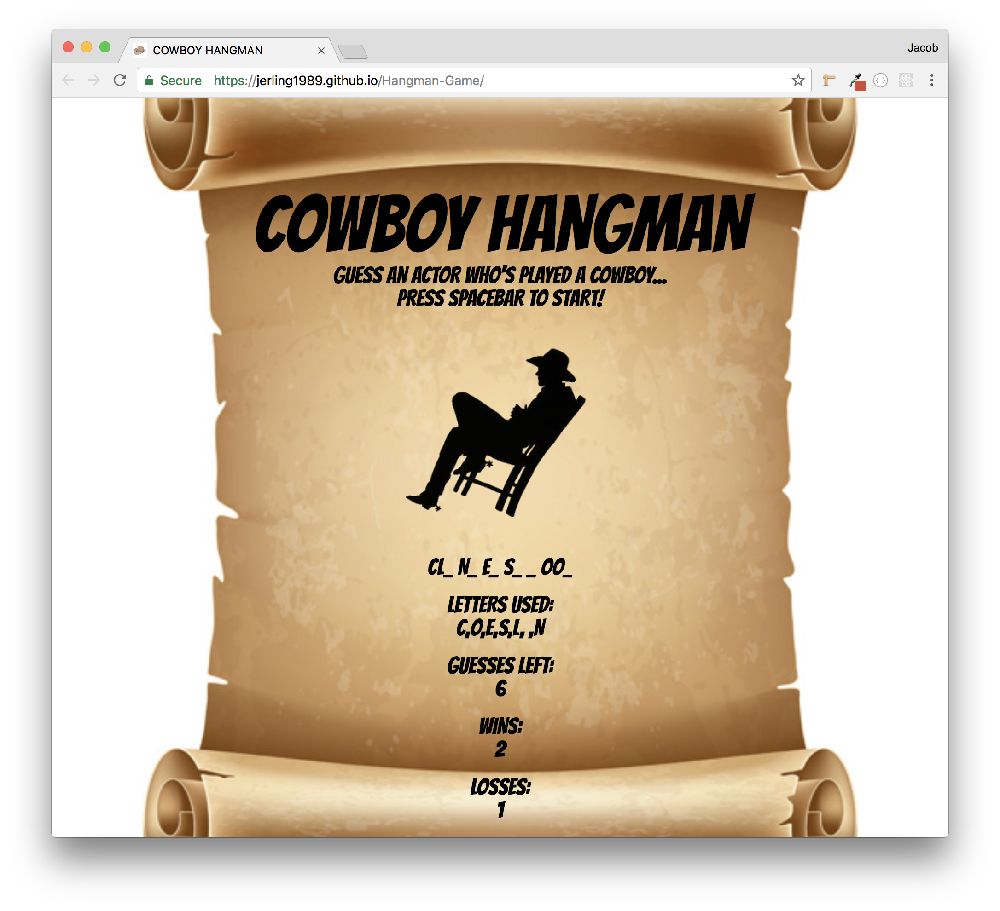

# Hangman-Game
Fun Hangman Game made with HTML5, CSS3, and vanilla JavaScript. The category of the game is actors who have played cowboys. This game was made by me during my enrollment at the Rutgers Coding Bootcamp after our Introduction to JavaScript course.

- The first thing the user will see is a the game title "COWBOY HANGMAN" and the instructions to start the game. I set the background of the page to look like an old west wanted poster for the theme of the game.

- This image shows the first game in progress, with the page displaying which letters have been used, which letters are correct, and how many guessed the user has left.

- This last image is here to show how after a few games the page will track how many Wins and Losses the user has for that session.

